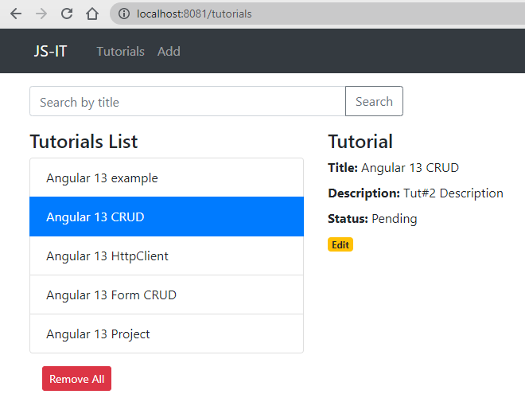

# Angular 13 example project: CRUD with Rest API

Build an Angular 13 CRUD App example to consume Rest APIs, display, modify & search data.

Tutorial Application in that:
- Each Tutorial has id, title, description, published status.
- We can create, retrieve, update, delete Tutorials.
- There is a Search bar for finding Tutorials by title.

More Practice:
> [Angular Pagination example | ngx-pagination](https://www.github.com/JS-IT/angular-12-pagination-ngx/)

> [Angular JWT Authentication & Authorization with Web API](https://www.github.com/JS-IT/angular-12-jwt-auth/)

> [Angular File upload example with progress bar & Bootstrap](https://www.github.com/JS-IT/angular-12-file-upload/)

> [Angular Multiple Files upload example with Progress Bar](https://www.github.com/JS-IT/angular-12-multiple-file-upload/)

Fullstack with Node.js:

> [Angular + Node.js Express + MySQL example](https://www.github.com/JS-IT/angular-12-node-js-express-mysql/)

> [Angular + Node.js + Express + PostgreSQL example](https://www.github.com/JS-IT/angular-12-node-js-express-postgresql/)

> [Angular + Node.js Express + MongoDB example](https://www.github.com/JS-IT/angular-12-mongodb-node-js-express/)

Security:
> [Angular + Node.js Express: JWT Authentication and Authorization example](https://www.github.com/JS-IT/node-js-angular-12-jwt-auth/)

Serverless with Firebase:
> [Angular 12 Firebase CRUD with Realtime DataBase | AngularFireDatabase](https://github.com/JS-IT/angular-12-firebase-crud/)

> [Angular 13 Firebase CRUD with Realtime DataBase | AngularFireDatabase](https://github.com/JS-IT/angular-13-firebase-crud/)

> [Angular 12 Firestore CRUD example with AngularFireStore](https://github.com/JS-IT/angular-12-firestore-crud/)

> [Angular 13 Firestore CRUD example with AngularFireStore](https://github.com/JS-IT/angular-13-firestore-crud/)

> [Angular 13 Firebase Storage: File Upload/Display/Delete example](https://github.com/JS-IT/angular-13-file-upload-firebase-storage/)

## Development server

Run `ng serve --port 8081` for a dev server. Navigate to `http://localhost:8081/`. The app will automatically reload if you change any of the source files.

## Code scaffolding

Run `ng generate component component-name` to generate a new component. You can also use `ng generate directive|pipe|service|class|guard|interface|enum|module`.

## Build

Run `ng build` to build the project. The build artifacts will be stored in the `dist/` directory.

## Running unit tests

Run `ng test` to execute the unit tests via [Karma](https://karma-runner.github.io).

## Running end-to-end tests

Run `ng e2e` to execute the end-to-end tests via a platform of your choice. To use this command, you need to first add a package that implements end-to-end testing capabilities.

## Further help

To get more help on the Angular CLI use `ng help` or go check out the [Angular CLI Overview and Command Reference](https://angular.io/cli) page.